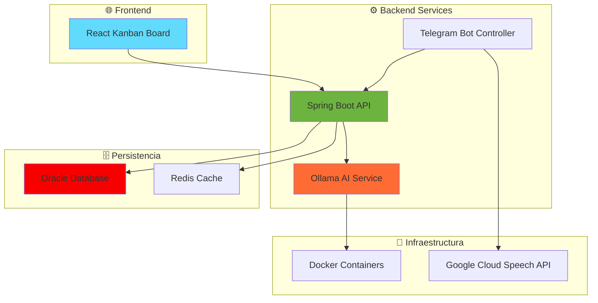

# 🐨 KoalAPEX - Sistema de Gestión de Tareas Empresarial

<div align="center">

[](https://spring.io/projects/spring-boot)
[](https://www.oracle.com/java/)
[](https://www.oracle.com/database/)
[](https://core.telegram.org/bots)
[](https://opensource.org/licenses/MIT)

### 🚀 **Una solución integral para la gestión de tareas y proyectos con integración de IA y bot de Telegram**

[**🎯 Demo**](#demo) **•** [**📖 Documentación**](#documentación) **•** [**⚡ Inicio Rápido**](#configuración-inicial) **•** [**🤝 Contribuir**](#contribución)

</div>

---

<div align="center">
  
## 📑 **Navegación Rápida**

</div>

<table align="center">
<tr>
<td valign="top" width="33%">

### 🏗️ **Proyecto**

- 📋 [**Descripción**](#descripción)
- ⭐ [**Características**](#características-principales)
- 🏛️ [**Arquitectura**](#arquitectura)
- 📁 [**Estructura**](#estructura-del-proyecto)

</td>

<td valign="top" width="33%">

### 🚀 **Configuración**

- ⚡ [**Inicio Rápido**](#configuración-inicial)
- 🐳 [**Docker**](#despliegue-con-docker)
- ⚙️ [**Variables de Entorno**](#variables-de-entorno)
- 🗄️ [**Base de Datos**](#configuración-de-base-de-datos)

</td>

<td valign="top" width="33%">

### 👥 **Comunidad**

- 👨‍💻 [**Autores**](#autores)
- 🤝 [**Contribuir**](#contribución)
- 🔐 [**Seguridad**](#política-de-seguridad)
- ⚖️ [**Licencia**](#licencia)

</td>
</tr>
</table>

---

## 👨‍💻 **Autores**

<table align="center">
<tr>
<td align="center" width="25%">
<a href="https://github.com/CodeKing25">
<br />
<sub><b>🌟 Diego Reyna</b></sub><br />
</a>
</td>
<td align="center" width="25%">
<a href="https://github.com/ElingeMisa">
<br />
<sub><b>🚀 Victor Escalante</b></sub><br />
</a>
</td>
<td align="center" width="25%">
<a href="https://github.com/uwelOriginal">
<br />
<sub><b>🔧 Hugo Pérez</b></sub><br />
</a>
</td>
<td align="center" width="25%">
<a href="https://github.com/July1-1">
<br />
<sub><b>🎨 Julio Madrigal</b></sub><br />
</a>
</td>
</tr>
</table>

---

## 📋 **Descripción**

> [!NOTE]  
> **KoalAPEX** es un proyecto empresarial diseñado para optimizar la productividad de equipos de desarrollo mediante la integración de tecnologías modernas y automatización inteligente.

**KoalAPEX** es un proyecto con el objetivo de mejorar la productividad de los equipos de desarrollo. Administrando tareas, proyectos, manteniendo una supervisión constante del progreso de las tareas y proyectos a lo ancho de múltiples equipos. La implementación de este proyecto consta de una aplicación web en la que los usuarios son capaces de acceder a sus equipos y proyectos.

### 🎯 **¿Para quién es KoalAPEX?**

<table>
<tr>
<td align="center" width="33%">
  
**👔 Managers**  
*Supervisión y asignación de tareas en tiempo real*

</td>
<td align="center" width="33%">
  
**👨‍💻 Desarrolladores**  
*Gestión personal de tareas y reportes de progreso*

</td>
<td align="center" width="33%">
  
**🏢 Equipos**  
*Colaboración efectiva en proyectos complejos*

</td>
</tr>
</table>

---

## ⭐ **Características Principales**

<table align="center">
<tr>
<td align="center" width="33%">

### 🤖 **IA Integrada**
- ✨ Análisis de intenciones con Ollama
- 🎤 Procesamiento de voz a texto
- 📊 Generación automática de reportes

</td>
<td align="center" width="33%">

### 📱 **Bot de Telegram**
- 🌍 Gestión de tareas desde cualquier lugar
- 🔔 Notificaciones en tiempo real
- 🎮 Comandos intuitivos por rol

</td>
<td align="center" width="33%">

### 🗄️ **Base de Datos Robusta**
- 🏛️ Oracle Database con esquemas optimizados
- 👥 Soporte para equipos y proyectos
- ⚡ Persistencia con Redis

</td>
</tr>
</table>

---

## 🏛️ **Arquitectura**



---

## ⚡ **Configuración Inicial**

### 📋 **Prerrequisitos**

> [!TIP]
> En caso de requerir trabajar con diferentes versiones de Java para distintos proyectos, te recomendamos editar la variable de entorno `JAVA_HOME` para apuntar a una instalación distinta.

<table>
<tr>
<td>

```bash
# Verificar versiones requeridas
java -version    # ☕ Java 11+
mvn -version     # 🔧 Maven 3.6+
docker --version # 🐳 Docker 20.10+
```

</td>
<td>

**Versiones mínimas requeridas:**
- ☕ **Java**: 11 o superior
- 🔧 **Maven**: 3.6 o superior  
- 🐳 **Docker**: 20.10 o superior

</td>
</tr>
</table>

### 🚀 **Instalación Rápida**

> [!IMPORTANT]  
> Asegúrate de tener todas las credenciales necesarias antes de iniciar la instalación.

```bash
# 1️⃣ Clonar el repositorio
git clone https://github.com/tu-usuario/koalapex.git
cd koalapex

# 2️⃣ Configurar variables de entorno
cp .env.example .env
# 📝 Editar .env con tus credenciales

# 3️⃣ Ejecutar con Docker Compose
docker-compose up -d

# 4️⃣ Verificar servicios
curl http://localhost:8080/actuator/health
```

### 🛠️ **Configuración Manual**

<details>
<summary><b>🔧 Expandir para ver configuración detallada</b></summary>

```bash
# 📦 Instalar dependencias
mvn clean install

# 🚀 Inicializar el proyecto de manera automática 
# Por medio del script containers.sh

source containers.sh
```

> [!NOTE]  
> El script `containers.sh` automatiza la configuración inicial de los contenedores y servicios.

</details>

---

## 🐳 **Despliegue con Docker**

### 🌟 **Opción 1: Desarrollo Local**

```bash
# 🔥 Servicios completos con hot-reload
docker-compose -f Docker/docker-compose.yaml up -d
```

> [!TIP]
> Utiliza `-d` para ejecutar en segundo plano y `--build` para reconstruir las imágenes.

### ☁️ **Opción 2: Producción (OCI)**

```bash
# ⚡ Configuración optimizada para cloud
docker-compose -f Docker/docker-compose-oci.yaml up -d
```

> [!WARNING]  
> Asegúrate de tener las credenciales de OCI configuradas correctamente antes de desplegar.

### 📊 **Monitoreo de Servicios**

<table>
<tr>
<td>

```bash
# 📋 Verificar estado
docker-compose ps

# 📜 Logs en tiempo real
docker-compose logs -f frontend
```

</td>
<td>

```bash
# 🏥 Healthchecks
curl http://localhost:8080/actuator/health
curl http://localhost:11434  # Ollama
curl http://localhost:6379   # Redis
```

</td>
</tr>
</table>

---

## ⚙️ **Variables de Entorno**

<details>
<summary><b>🔧 Configuración Completa</b></summary>

> [!CAUTION]
> Nunca subas credenciales reales al repositorio. Usa secrets management para producción.

```bash
# 🗄️ Base de Datos
db_url=jdbc:oracle:thin:@//host:port/service
db_user=TODOUSER
dbpassword=tu_password_seguro

# 🤖 Telegram Bot
TELEGRAM_BOT_TOKEN=tu_bot_token
TELEGRAM_BOT_NAME=tu_bot_name

# ☁️ Google Cloud
GOOGLE_APPLICATION_CREDENTIALS=/path/to/credentials.json

# 🧠 Ollama AI
ollama.api.url=http://ollama:11434/api/generate
ollama.default.model=deepseek-r1:14b
ollama.temperature=0.7

# 🔧 Features
intent.analysis.enabled=true
intent.auto-execute.enabled=true
```

</details>

---

## 📁 **Estructura del Proyecto**

<details>
<summary><b>🗂️ Ver estructura completa</b></summary>

```
koalapex/
├── 🐳 Docker/                    # Configuraciones de contenedores
│   ├── docker-compose.yaml       # Desarrollo local
│   ├── docker-compose-oci.yaml   # Producción cloud
│   └── ollama/                   # Configuración IA
├── 📁 src/main/java/.../
│   ├── 🎮 controller/            # Endpoints REST y Bot
│   ├── 🔧 service/               # Lógica de negocio
│   ├── 🗄️ repository/           # Acceso a datos
│   ├── 📊 model/                 # Entidades JPA
│   ├── ⚙️ config/               # Configuraciones
│   └── 🤖 handlers/              # Manejadores del bot
├── 📱 src/main/kanban-board-master/ # Frontend React
├── 🔐 Walet/                     # Credenciales Oracle
└── 📄 pom.xml                    # Dependencias Maven
```

</details>

---

## 🗄️ **Configuración de Base de Datos**

### 🏗️ **Esquema Principal**

> [!IMPORTANT]  
> La aplicación utiliza el esquema `TODOUSER` con un modelo relacional optimizado para gestión de proyectos ágiles.

<table>
<tr>
<td width="50%">

**📊 Entidades Principales:**
- 👥 **USUARIOS**: Gestión de usuarios del sistema
- 👨‍💻 **DESARROLLADOR**: Información específica de desarrolladores
- 👔 **MANAGER**: Datos de administradores
- 🏢 **EQUIPO**: Configuración de equipos de trabajo

</td>
<td width="50%">

**📈 Gestión de Proyectos:**
- 📋 **PROYECTO**: Gestión de proyectos
- ✅ **TAREA**: Tareas individuales
- 🔄 **SPRINT**: Ciclos de desarrollo ágil
- 🔗 **Relaciones**: Tablas de asociación

</td>
</tr>
</table>

### 🔗 **Configuración de Conexión**

```properties
# 📝 application.properties
spring.datasource.url=${db_url}
spring.datasource.username=${db_user}
spring.datasource.password=${dbpassword}
spring.jpa.hibernate.ddl-auto=validate
```

---

## ⌨️ **Comandos Disponibles**

<table>
<tr>
<td align="center"><b>🏗️ Build</b></td>
<td align="center"><b>🧪 Testing</b></td>
<td align="center"><b>🐳 Docker</b></td>
</tr>
<tr>
<td>

```bash
# 📦 Compilar proyecto
mvn clean compile

# 📋 Generar JAR
mvn clean package

# 🚀 Ejecutar aplicación
mvn spring-boot:run
```

</td>
<td>

```bash
# 🧪 Ejecutar tests
mvn test

# 📊 Tests con cobertura
mvn test jacoco:report

# 🔍 Tests de integración
mvn verify
```

</td>
<td>

```bash
# 🏗️ Build imagen
docker build -t koalapex .

# 🚀 Ejecutar contenedor
docker run -p 8080:8080 koalapex

# 📦 Docker Compose
docker-compose up -d
```

</td>
</tr>
</table>

---

## 🤖 **Bot de Telegram - Guía de Uso**

### 📝 **Comandos por Rol**

<details>
<summary><b>👔 Comandos para Managers</b></summary>

<table>
<tr>
<td>

**🚀 Básicos**
- `/start` - Inicializar bot
- `Mostrar Pantalla Principal` - Menú principal

</td>
<td>

**📊 Gestión**
- `➕ Nueva Tarea` - Crear tarea para desarrolladores
- `📋 Lista de Tareas` - Ver todas las tareas del equipo

</td>
<td>

**📈 Análisis**
- `📊 KPIs del Equipo` - Ver métricas de rendimiento
- `🔔 Notificaciones` - Gestionar alertas del equipo

</td>
</tr>
</table>

</details>

<details>
<summary><b>👨‍💻 Comandos para Desarrolladores</b></summary>

<table>
<tr>
<td>

**🚀 Básicos**
- `/start` - Inicializar bot
- `Mostrar Pantalla Principal` - Menú principal

</td>
<td>

**✅ Tareas**
- `➕ Nueva Tarea` - Crear tarea personal
- `📋 Mis Tareas` - Ver tareas asignadas

</td>
<td>

**📊 Progreso**
- `✅ Marcar como Completada` - Actualizar estado
- `📊 Mi Progreso` - Ver estadísticas personales

</td>
</tr>
</table>

</details>

---

## 🤝 **Contribución**

<div align="center">

**¡Contribuciones son bienvenidas! 🎉**

</div>

### 🔄 **Proceso de Contribución**

> [!TIP]
> Antes de contribuir, revisa los issues abiertos para evitar duplicados.

1. **🍴 Fork** el repositorio
2. **🌿 Crea** una rama feature (`git checkout -b feature/amazing-feature`)
3. **💾 Commit** tus cambios (`git commit -m 'Add amazing feature'`)
4. **📤 Push** a la rama (`git push origin feature/amazing-feature`)
5. **🔃 Abre** un Pull Request

### 📝 **Estándares de Código**

<table>
<tr>
<td width="50%">

**☕ Java**
- Seguir convenciones de Spring Boot
- Documentar métodos públicos
- Tests unitarios obligatorios

</td>
<td width="50%">

**📝 Commits**
- Usar [Conventional Commits](https://www.conventionalcommits.org/)
- Mensajes descriptivos
- Referencia a issues

</td>
</tr>
</table>

> [!IMPORTANT]  
> Cobertura de tests mínima requerida: **80%**

### 🐛 **Reportar Issues**

- 📋 Usar las [plantillas de issues](.github/ISSUE_TEMPLATE/)
- 📝 Incluir logs y pasos para reproducir
- 🔍 Especificar versión y entorno

---

## 🔐 **Política de Seguridad**

> [!WARNING]  
> **Seguridad Crítica**: Este proyecto maneja datos empresariales sensibles. Sigue las mejores prácticas de seguridad.

### 🛡️ **Medidas Implementadas**

<table>
<tr>
<td align="center" width="25%">

**🔐 Autenticación**  
Spring Security con roles diferenciados

</td>
<td align="center" width="25%">

**🛡️ Autorización**  
Control de acceso basado en roles (RBAC)

</td>
<td align="center" width="25%">

**🔒 Cifrado**  
Credenciales encriptadas en BD

</td>
<td align="center" width="25%">

**📋 Auditoría**  
Logging completo de acciones

</td>
</tr>
</table>

### 🚨 **Reportar Vulnerabilidades**

> [!CAUTION]
> **NUNCA** reportes vulnerabilidades en issues públicos.

1. **❌ NO** crear un issue público
2. **📧 Enviar** email a: `security@koalapex.com`
3. **⏱️ Esperar** confirmación (< 48h)
4. **🤝 Colaborar** en la resolución

---

## ⚖️ **Licencia**

<div align="center">

### **MIT License**

Ver [LICENSE](LICENSE) para más detalles.

```
Copyright (c) 2024 KoalAPEX Team

Se concede permiso para usar, copiar, modificar y distribuir este software...
```

---

**🐨 Hecho con ❤️ por el equipo KoalAPEX**


</div>